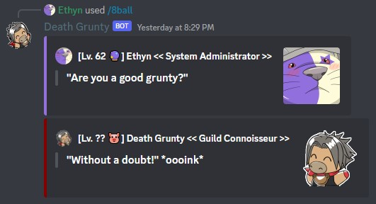

The ***/8ball*** command is exactly what you think it is: you ask a question, and a random answer is given to you. Like a real magic 8 ball, Death Grunty will give you three kinds of answers: postive, neutral, and negative. 

Some answers that Death Grunty gives reflect his personality and thus may offend you, but he probably doesn't mean it...

### Usage Examples

- /8ball command producing a positive answer.

- /8ball command producing a negative answer.
