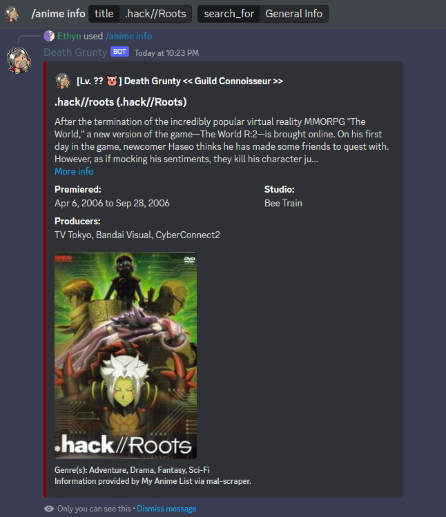

Death Grunty heckin' loves anime. The ***/anime*** command lets you look up information about an anime such as its synopsis, characters, and images.

### Usage Examples

- Looking up general info about .hack//Roots
