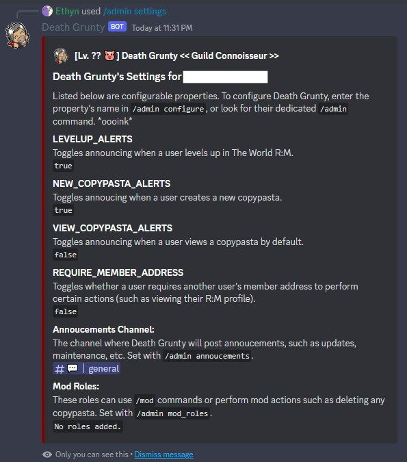

The ***/admin*** command allows server owners/admins to **configure Death Grunty for their server** and add what roles can use ***/mod*** commands. For example, you can toggle notifications for certain commands or set what channel Death Grunty will post updates in.

### Usage Examples

- Viewing how Death Grunty is configured for your server.

