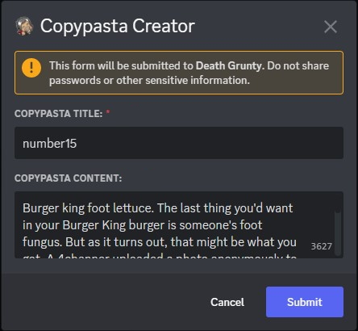
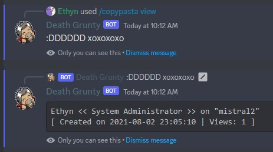

The ***/copypasta*** command lets you **create and view copypastas** on your server. Copypastas can be up to **4000** characters long and you can rename, edit, and delete your own copypastas at anytime. Currently, each user can only have up to **100** copypastas per server.

The content inside these copypastas are not moderated, so you are responsible for what you users put/see in them.

### Usage Examples

- Creating a new copypasta.

- Viewing a copypasta.

