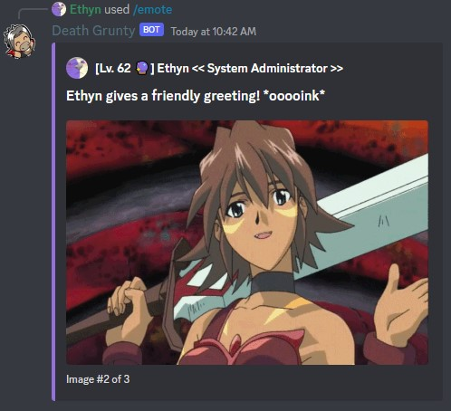

The ***/emote*** command lets you display reactions using **random GIFs/images** from the .hack franchise. You can also choose whether to react to a specific user or to no one in particular. Majority of these images are GIFs and come from the .hack animes.

### Usage Examples

- Emoting with the "greet" reaction.

- Emoting with the "greet" reaction to a specific user.
