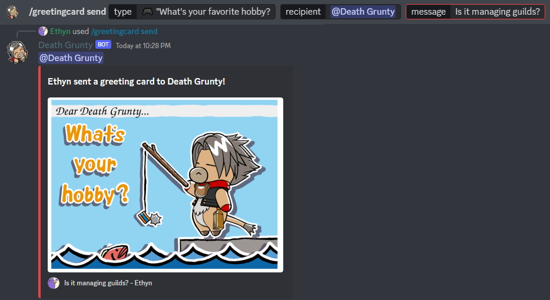

The ***/greetingcard*** command lets you **send preset greeting cards** to other users, with their name attached to it. Those familiar with Death Grunty's greeting cards from .hack//G.U. will know how these greeting cards look like. You may also attach an additional message to these greeting cards.

Greeting cards are a means of increasing affection with someone in .hack//G.U., but your mileage on your server may vary.

### Usage Examples

- Sending a greeting card asking about one's hobby to Death Grunty.
