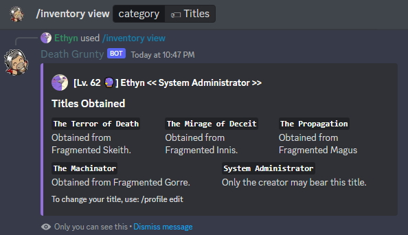

The ***/inventory*** command lets you **view and use items** in your inventory. Items have a variety of uses, such as giving you a **quick EXP boost** or **changing your player character's title**. Items can also be earned via purchasing from a shop or obtaining them in The World R:M.

### Usage Examples

- Viewing obtained titles.
