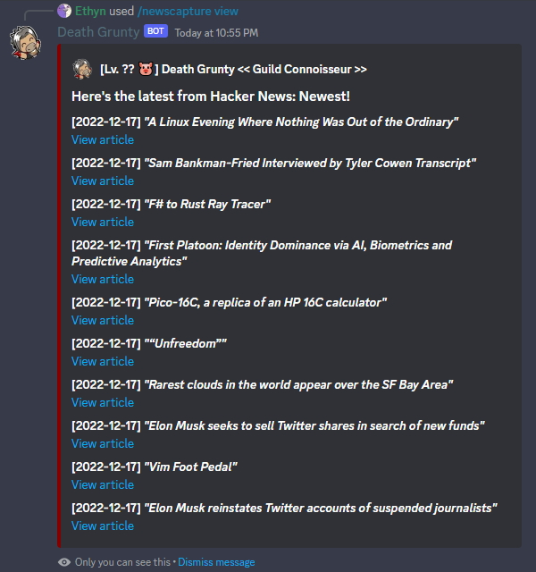

Like the **News Capture application** from your desktop in .hack//G.U., the ***/newscapture*** command lets you view news occuring in the real world. Currently, it is limited to showing video game, technology, and anime news. 

### Usage Examples

- Viewing tech-related news provided by Hacker News.
