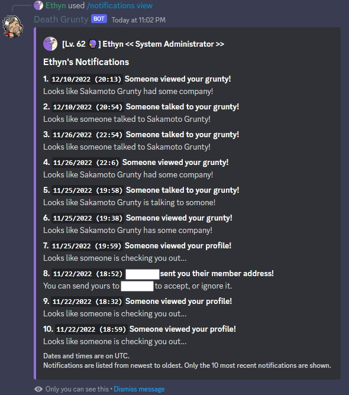

The ***/notifications*** command lets you view when someone interacted with your content on Death Grunty. For example, you will see notifications for when someone viewed your profile, talked to your pet grunty, viewed a copypasta you created, and more.

### Usage Examples

- Viewing notifications about who viewed your copypastas, talked to your pet grunty, etc.
