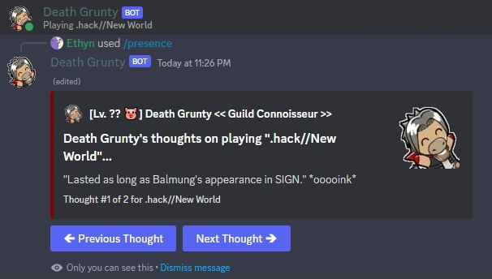

The ***/presence*** command lets you **browse Death Grunty's thoughts**. You might notice that Death Grunty is sometimes **watching, playing, or listening to** something; if you're curious about what he thinks about it, use this command.

### Usage Examples

- Viewing Death Grunty's thoughts on .hack//New World.
