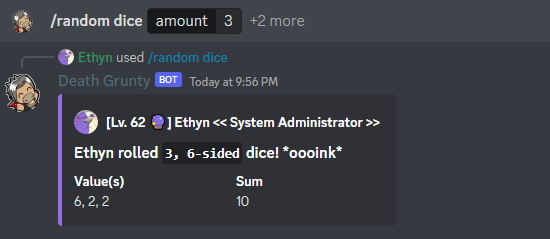

The ***/random*** command contains a collection of simple rng-related actions such as flipping a coin, generating a random number, randomly choose from a list of items, and rolling dice.

### Usage Examples

- Asking Death Grunty to choose from a list of items.

- Rolling 3 dice.
