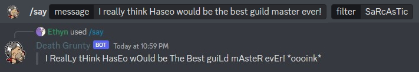

The ***/say*** command allows you to make Death Grunty **say something in a certain way**. For example, you can make Death Grunty speak like a pirate, a 1337 hacker, or an obnoxious internet person from 2007.

### Usage Examples

- Death Grunty saying a phrase with the sarcastic filter.
